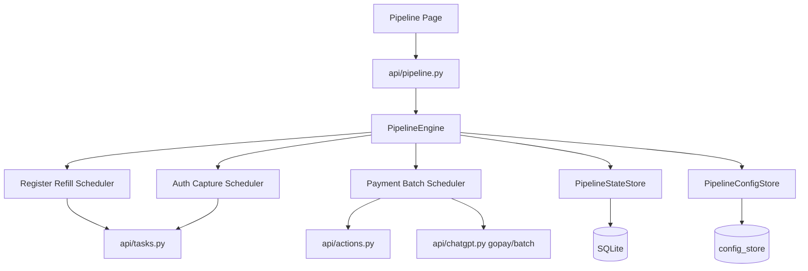

# Design Document: ChatGPT Auto Pipeline

## Overview

本设计文档描述 `any-auto-register-local-live-icloud-hme` 中 ChatGPT 自动流水线模块的技术设计。

该模块采用“注册补货 + 支付批处理 + 可选 Auth 补抓”的编排方式，而不是把单个账号强行串成一条长事务链。其核心目标是：

- 尽量复用现有注册任务、`payment_link` action、GoPay batch、Auth task
- 用独立的流水线任务表和账号记录表承载流程状态
- 避免 `accounts.status` 与流程状态互相覆盖
- 支持页面关闭后恢复查看、服务重启后恢复调度或对账

## Design Goals

- **复用优先**：注册、支付、补抓尽量调用现有实现，不重写成熟逻辑
- **状态分层**：账号主状态与流水线阶段状态分离
- **调度解耦**：注册、支付、Auth 三个调度器彼此协作但不互相阻塞
- **恢复可见**：页面刷新、窗口关闭、服务重启后能够恢复任务视图
- **最小侵入**：除状态一致性与必要集成点外，不大幅改动现有模块
- **统一展示语义**：自动流水线页面与现有 `Accounts` 页面必须共享一致的状态写入与展示规则

## Non-Goals

- 第一版不做支付失败自动重试
- 第一版不把历史人工注册账号纳入自动支付池
- 第一版不实现多条并行流水线同时运行
- 第一版不自定义新的 GoPay 手机号分配算法

## Architecture

### High-Level Architecture



### Core Components

- `PipelineEngine`
  负责整个流水线生命周期、启停控制、恢复逻辑和状态对账
- `RegisterRefillScheduler`
  负责待支付池补货
- `PaymentBatchScheduler`
  负责按固定时间触发支付批次
- `AuthCaptureScheduler`
  负责可选 Auth 顺序补抓
- `PipelineStateStore`
  负责 `PipelineTask` / `PipelineAccountItem` 的持久化读写
- `PipelineConfigStore`
  负责配置的校验、加载、存储

## Execution Model

### 1. 注册补货调度器

职责：

- 维护待支付池深度
- 判断是否触发新的注册补货任务
- 接管现有注册任务完成结果

规则：

- 当待支付池数量 `< payment_pool_threshold` 时触发补货
- 目标补到 `payment_pool_target`
- 同一时刻最多一个活跃注册补货任务

补货触发时机：

- 流水线启动时
- 流水线从暂停恢复时
- 任一注册任务结束时
- 任一支付批次结束且导致待支付池变化时

### 2. 支付批处理调度器

职责：

- 每隔 `payment_batch_interval_seconds` 判断是否应启动一批支付
- 从待支付池中选出账号并预留
- 为选中账号生成订阅链接
- 启动并跟踪现有 GoPay batch

规则：

- 只有在没有活跃 GoPay batch 时才允许启动新批次
- 可用手机号数量定义为 `enabled=true && status=ready` 的唯一手机号条目数
- 批次大小：

```text
min(
  待支付账号数量,
  可用手机号数量,
  payment_batch_max_size == 0 ? +inf : payment_batch_max_size
)
```

### 3. Auth 补抓调度器

职责：

- 在 `enable_auth_capture=true` 时，消费 `Paid_Pool`
- 单线程顺序触发现有 Auth 补抓 task
- 记录补抓成功/失败结果

规则：

- 默认关闭
- 打开后顺序执行，不并发
- Auth 失败只影响 `auth_stage` 与流程态，不回退账号主状态

## State Model

### Primary Account Status

`accounts.status` 仅表示稳定主状态：

- `registered`
- `subscribed`
- `payment_failed`
- `invalid`
- `expired`
- `trial`

写入规则：

- 注册成功后可写 `registered`
- 支付成功后写 `subscribed`
- 支付失败后写 `payment_failed`
- Auth 补抓不得改写支付主状态
- 本地探测/远端同步只能在明确失效时写 `invalid` / `expired`
- 现有 `Accounts` 页面刷新链路必须基于同一规则渲染，避免主状态被旧 probe 或不完整能力快照覆盖

### Pipeline Flow Status

流程状态全部放在 `PipelineAccountItem` 中。

#### `pipeline_status`

推荐值：

- `pending_register`
- `registering`
- `pending_payment`
- `payment_reserved`
- `link_generating`
- `link_ready`
- `paying`
- `paid`
- `auth_pending`
- `auth_running`
- `done`
- `failed`
- `auth_failed`

#### `register_stage`

- `pending`
- `running`
- `success`
- `failed`

#### `payment_stage`

- `pending`
- `reserved`
- `link_generating`
- `link_ready`
- `paying`
- `success`
- `failed`

#### `auth_stage`

- `disabled`
- `pending`
- `running`
- `success`
- `failed`
- `skipped`

## Data Models

### PipelineConfig

```python
class PipelineConfig(BaseModel):
    payment_pool_threshold: int = 3
    payment_pool_target: int = 6
    payment_batch_interval_seconds: int = 300
    payment_batch_max_size: int = 0

    auto_start: bool = False
    enable_auth_capture: bool = False
    auth_poll_interval_seconds: int = 3
    register_poll_interval_seconds: int = 3
    gopay_batch_poll_interval_seconds: int = 3
    gopay_timeout_seconds: int = 1800

    platform: str = "chatgpt"
    mail_provider: str = ""
    proxy: str | None = None
    executor_type: str = "protocol"
    captcha_solver: str = "yescaptcha"
    register_extra: dict = Field(default_factory=dict)

    gopay_country: str = "ID"
    gopay_currency: str = "IDR"
    gopay_plan: str = "plus"
```

### PipelineTask

```python
class PipelineTask(SQLModel, table=True):
    __tablename__ = "pipeline_tasks"

    id: Optional[int] = Field(default=None, primary_key=True)
    task_key: str = Field(index=True, unique=True)
    status: str = Field(default="stopped", index=True)
    # running / paused / stopping / stopped / done / failed

    active_register_task_id: str = ""
    active_payment_batch_id: str = ""
    active_auth_task_id: str = ""

    config_snapshot_json: str = "{}"
    last_error: str = ""
    started_at: Optional[datetime] = None
    stopped_at: Optional[datetime] = None
    created_at: datetime = Field(default_factory=_utcnow)
    updated_at: datetime = Field(default_factory=_utcnow)
```

### PipelineAccountItem

```python
class PipelineAccountItem(SQLModel, table=True):
    __tablename__ = "pipeline_account_items"

    id: Optional[int] = Field(default=None, primary_key=True)
    pipeline_task_id: int = Field(index=True)

    source: str = "pipeline_register"
    source_register_task_id: str = ""
    source_register_attempt: int = 0

    account_id: Optional[int] = Field(default=None, index=True)
    email: str = Field(default="", index=True)

    pipeline_status: str = Field(default="pending_register", index=True)
    register_stage: str = Field(default="pending", index=True)
    payment_stage: str = Field(default="pending", index=True)
    auth_stage: str = Field(default="disabled", index=True)

    account_primary_status: str = "registered"

    checkout_url: str = ""
    payment_batch_task_id: str = ""
    gopay_session_id: str = ""
    gopay_uid: str = ""

    subscription_plan_expected: str = ""
    subscription_plan_confirmed: str = ""
    subscription_refresh_status: str = ""
    subscription_refreshed_at: str = ""

    register_error_code: str = ""
    register_error_reason: str = ""
    register_error_detail: str = ""

    payment_failed_stage: str = ""
    payment_error_code: str = ""
    payment_error_reason: str = ""
    payment_error_detail: str = ""

    auth_error_code: str = ""
    auth_error_reason: str = ""
    auth_error_detail: str = ""

    success_summary: str = ""

    register_started_at: Optional[datetime] = None
    register_completed_at: Optional[datetime] = None
    payment_started_at: Optional[datetime] = None
    payment_completed_at: Optional[datetime] = None
    auth_started_at: Optional[datetime] = None
    auth_completed_at: Optional[datetime] = None

    created_at: datetime = Field(default_factory=_utcnow)
    updated_at: datetime = Field(default_factory=_utcnow)
```

## Integration Strategy

### Registration Integration

复用现有注册任务：

- 调用 `enqueue_register_task(...)`
- `source="pipeline"`
- `meta={"pipeline_task_id": ..., "pipeline_key": ...}`

结果获取策略：

- 轮询注册任务状态直到终态
- 通过 `task_id + source + created_at + pipeline meta` 定位本批新增账号
- 将新增账号写入 `PipelineAccountItem`

### Payment Link Integration

复用现有 `payment_link` action，而不是直接调用底层 `generate_plus_link`：

- 原因：`payment_link` 路径还会写入 pending subscription auth 相关信息
- 输入：`account_id + plan/country/currency`
- 输出：`checkout_url`

### GoPay Batch Integration

复用现有 `gopay/batch/start` 与 `gopay/batch/{id}`：

- 按选中账号构造 batch items
- 不接管手机号池内部状态机
- 轮询现有 batch 结果并映射回 `PipelineAccountItem`

如果流水线重启时已有活跃 GoPay batch：

- 先通过现有活跃 batch 接口恢复其状态
- 再把 batch item 状态重新投影到 `PipelineAccountItem`

### Auth Integration

复用 `enqueue_resume_subscription_auth_task(account_id)`：

- 顺序触发
- 轮询 task 状态
- 把结果写回 `PipelineAccountItem`

## Subscription Refresh Strategy

支付成功后必须执行一次订阅信息刷新。

目标：

- 主状态保持 `subscribed`
- 更新本地订阅信息
- 让页面正确显示套餐类型

建议顺序：

1. GoPay batch item 进入支付成功态
2. 将 `accounts.status` 标记为 `subscribed`
3. 触发本地订阅探测/刷新
4. 将探测得到的套餐类型写入：
   - 账号可展示字段
   - `PipelineAccountItem.subscription_plan_confirmed`
5. 若刷新失败：
   - 保留主状态 `subscribed`
   - `subscription_plan_confirmed = "unknown"`
   - `subscription_refresh_status = "failed"`

## Existing Accounts Page Consistency

自动流水线的交付范围不只包含新页面，也包含现有 `Accounts` 页的状态一致性修复。

### Scope

- 修复已支付账号在现有账号列表刷新后回退成“已注册”的问题
- 修复支付成功后订阅类型未刷新的问题
- 统一 `Accounts` 页面与自动流水线页面的状态解释口径

### Design Rules

1. `Accounts` 页面中的主状态展示继续以 `accounts.status` 为准，但不得把它当作唯一流程状态来源。
2. `Accounts` 页面应能消费稳定主状态之外的辅助字段，例如：
   - 本地订阅探测结果
   - 订阅刷新状态
   - 流程摘要信息
3. 若支付主状态已确认成功，而订阅刷新仍未完成，则 `Accounts` 页面应展示：
   - 主状态：已支付/已订阅
   - 订阅类型：待刷新或 `unknown`
4. `Accounts` 页面不应因为一次旧的 probe、缺失的 `chatgpt_capabilities` 或未及时更新的 `chatgpt_local`，把已支付账号展示回“已注册”。
5. 若需要最小修改现有状态策略函数或状态写回链路，应优先在共享后端逻辑处修复，而不是只在前端页面做临时兜底。

## Failure Model

### Register Errors

典型错误码：

- `proxy_error`
- `mailbox_error`
- `captcha_error`
- `registration_failed`

### Payment Errors

典型错误码：

- `not_eligible`
- `proxy_error`
- `checkout_invalid`
- `auth_missing`
- `otp_timeout`
- `session_missing`
- `payment_declined`

### Auth Errors

典型错误码：

- `add_phone_required`
- `add_phone_blocked`
- `pending_not_found`
- `session_missing`
- `proxy_error`
- `unknown_error`

## Recovery Strategy

### UI Recovery

页面重新打开时：

- 读取 `PipelineTask`
- 读取关联 `PipelineAccountItem`
- 查询现有活跃 GoPay batch
- 如果有活跃 batch，返回 batch 最新快照给前端

### Process Restart Recovery

服务重启后：

1. 加载最后一条活跃或最近的 `PipelineTask`
2. 检查是否存在活跃 GoPay batch
3. 对账：
   - 如果 batch 仍活跃，则接管并继续跟踪
   - 如果注册任务是内存态且已丢失，则将对应中间态账号转入失败或待重新评估
   - 如果 Auth task 已丢失，则将其恢复为待补抓或失败，取决于是否可重放
4. 若 `auto_start=true`，恢复调度器

## API Design

### Endpoints

- `GET /api/pipeline/config`
- `PUT /api/pipeline/config`
- `POST /api/pipeline/start`
- `POST /api/pipeline/stop`
- `POST /api/pipeline/pause`
- `GET /api/pipeline/status`
- `GET /api/pipeline/history`
- `GET /api/pipeline/logs/stream`

### `GET /api/pipeline/status` Response Shape

```json
{
  "task": {
    "id": 1,
    "status": "running",
    "active_register_task_id": "task_...",
    "active_payment_batch_id": "gopay_batch_...",
    "active_auth_task_id": ""
  },
  "config": {},
  "queues": {
    "pending_payment": [],
    "paid": [],
    "failed": [],
    "auth_pending": []
  },
  "active_payment_batch": {},
  "summary": {
    "pending_payment_count": 0,
    "paid_count": 0,
    "failed_count": 0,
    "auth_pending_count": 0
  }
}
```

## Frontend Design

页面结构：

1. 顶部状态栏
   - 流水线状态
   - 活跃注册任务
   - 活跃支付批次
   - 活跃 Auth 任务
2. 配置区
3. 调度控制区
4. 待支付池
5. 当前批量支付任务区
6. 已支付池
7. 失败池
8. Auth 队列
9. 实时日志

展示原则：

- 主状态和流程状态同时展示
- 失败原因直接可见
- 支持“已支付 + 套餐待刷新/unknown”的中间态显示
- 现有 `Accounts` 页面与自动流水线页面共享同一套状态展示语义

## Concurrency and Locking

- 同一时刻最多一个活跃注册补货任务
- 同一时刻最多一个活跃 GoPay batch
- Auth 补抓单线程
- 账号一旦进入 `payment_reserved` 状态，不可再次被选入新批次
- 所有队列状态变更必须在持久化层具备原子性

## Main Integration Points

需要新增：

- `services/pipeline/`
- `api/pipeline.py`
- `frontend/src/pages/Pipeline.tsx`
- `main.py` 中注册路由与可选自动启动逻辑

需要复用：

- `api/tasks.py`
- `api/actions.py`
- `api/chatgpt.py`
- `services/chatgpt_account_state.py`
- 现有 GoPay batch 状态恢复逻辑
