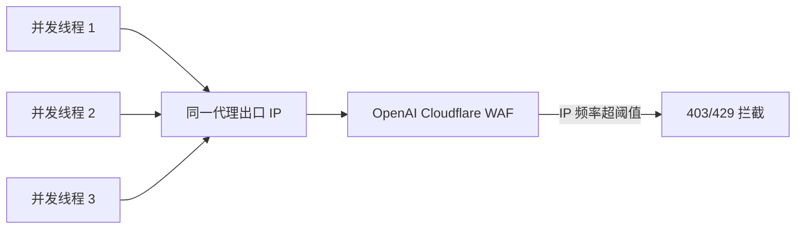
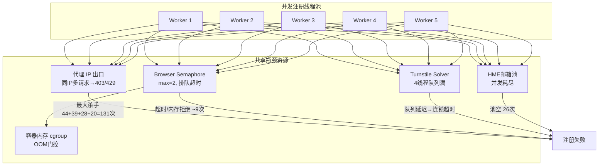

# ChatGPT 注册失败根因分析报告

> [!NOTE]
> 分析对象：`auto-gpt` 主实例 + `auto-gpt-plus` 实例的 `task_logs` 数据库，结合注册代码架构。
> 分析时间：2026-08-04

---

## 1. 总体失败概况

### 主实例 (auto-gpt)

| 状态 | 数量 | 占比 |
|:---|:---:|:---:|
| **failed** | 713 | **38.3%** |
| success | 687 | 36.9% |
| stopped | 256 | 13.8% |
| running | 175 | 9.4% |
| done | 14 | 0.8% |

> [!WARNING]
> 整体失败率高达 **38.3%**（排除手动停止后，纯注册失败率约 **50.9%**，即 `713/(713+687+14)`）。

### Plus 实例 (auto-gpt-plus)

| 状态 | 数量 |
|:---|:---:|
| done | 485 |
| failed | 312 |
| stopped | 213 |
| success | 212 |

---

## 2. 失败错误分类（主实例 713 次失败）

| 错误类别 | 次数 | 占比 | 与并发的关系 |
|:---|:---:|:---:|:---|
| 📧 **手机号绑定阶段失败** (Internal Server Error) | 67 | 9.4% | 🟡 上游 SMS 服务过载 |
| 🛡️ **Cloudflare 403 拦截**（提交邮箱时） | 44 | 6.2% | 🔴 并发直接触发 |
| 🔐 **验证码提交 403** | 39 | 5.5% | 🔴 并发直接触发 |
| ⏱️ **429 请求限流** (Too many requests) | 28 | 3.9% | 🔴 并发直接触发 |
| 📭 **HME 邮箱池耗尽** | 26 | 3.6% | 🟡 高并发消耗加速 |
| 📦 **未获取 workspace 产物** | 25 | 3.5% | 🟢 非并发相关 |
| 🗑️ **账号已被删除/停用** | 21 | 2.9% | 🟢 存量问题 |
| 🔒 **最终 URL 403** (Cloudflare) | 20 | 2.8% | 🔴 并发触发 |
| 🏠 **首页访问失败** | 15 | 2.1% | 🟡 代理/网络 |
| 📱 **手机号验证页拦截** | 15 | 2.1% | 🟡 风控触发 |
| 🏢 **无有效组织 workspace** | 12 | 1.7% | 🟢 账号状态 |
| 🌐 **Browser 启动/上下文失败** | 5 | 0.7% | 🔴 内存竞争 |
| ⛔ **注册被禁止 (IP 封禁)** | 3 | 0.4% | 🔴 同 IP 并发 |
| 🤖 **Sentinel 浏览器不可用** | 2 | 0.3% | 🔴 信号量瓶颈 |
| ⏳ **OAuth 浏览器事务超时** | 2 | 0.3% | 🔴 排队超时 |

> [!IMPORTANT]
> **与并发直接相关的错误（🔴 标记）合计约 139 次，占失败总量的 19.5%**。加上间接受并发影响的（🟡）约 108 次，**并发相关失败占比约 34.6%**。

---

## 3. 六大根因深度分析

### 根因 ①：Cloudflare / OpenAI 反爬 IP 级限流（最大杀手）

**错误表现：**
- `提交邮箱失败: 403 - <!DOCTYPE html><html...Just a moment...`（44 次）
- `验证码失败: HTTP 403`（39 次）
- `status=403 final_url=https://chatgpt.com/`（20 次）
- `429 - Too many requests`（28 次）

**根因机制：**



代码中虽然有 `unique_exit_ip_enabled` 机制（`api/tasks.py:17472-17511`），但：

1. **默认关闭**：`_truthy(initial_merged_extra.get("chatgpt_register_unique_exit_ip_enabled"), default=False)`
2. 即使开启，动态代理 IP 刷新有探测预算限制（`max_refresh_attempts`），IP 池不够大时仍会冲突
3. 三个容器实例（auto-gpt / plus / plus2）**各自独立维护 `unique_exit_ip_assigned` 集合**，无跨实例 IP 去重

**并发放大效应：** 同一代理出口 IP，5 个并发线程在 ≤30 秒窗口内向 `chatgpt.com` 发起 5 组首页+CSRF+signin+authorize 请求，触发 Cloudflare 的请求频率阈值。

---

### 根因 ②：Sentinel Browser 信号量瓶颈 + 内存门控

**代码证据** (`services/chatgpt_core/sentinel_browser.py:35-87`):

```python
AUTH_BROWSER_MAX_CONCURRENCY = max(1, min(int(os.getenv("AUTH_BROWSER_MAX_CONCURRENCY", "2")), 8))
_AUTH_BROWSER_SEMAPHORE = threading.BoundedSemaphore(AUTH_BROWSER_MAX_CONCURRENCY)
```

- **默认并发上限 = 2**，但注册任务的 `ThreadPoolExecutor` 最多可以开 5 个 worker
- 当 `concurrency=5` + `executor_type=headless` 时，3 个线程被阻塞等待信号量
- 等待期间 OTP 验证码可能超时（默认窗口 120s），浏览器内存可能触发 cgroup OOM 门控

**内存双重门控** (`services/chatgpt_core/sentinel_browser.py:81-87`):
```python
def _browser_memory_allows_second_slot():
    # 当已用内存 + 1280MiB 预留 > cgroup limit 时拒绝第二个浏览器
    return current + reserve <= limit
```

> Camoufox 单实例内存开销约 150-400MB，两个并发浏览器 + 4 线程 Turnstile solver 在 cgroup 限制下容易触发内存拒绝。

---

### 根因 ③：Turnstile Solver 单端口队列化

**现状：** 每个容器内运行 **1 个 solver 进程，4 个线程**：
```
/usr/local/bin/python -u /app/services/turnstile_solver/start.py --browser_type camoufox --thread 4
```

当多个注册线程同时请求 Turnstile 验证码解决时：
- 4 线程 solver 队列满后，后续请求排队
- solver 本身使用 Camoufox 浏览器，与 Sentinel Browser 共享宿主机内存
- 在高并发下，solver 响应时间增加，导致注册请求在等待 captcha 期间被 OpenAI 的 session 超时截断

---

### 根因 ④：CSRF Token / Session 时效性竞态

**注册协议流程**（`services/chatgpt_core/any_auto/register.py:415-476`）：

```
① 访问 chatgpt.com → 获取 oai-did cookie
② GET /api/auth/csrf → 获取 csrfToken
③ POST signin/openai → 获取 authorize URL
④ 访问 authorize URL → 进入邮箱/OTP 验证
```

**并发问题：**
- 每个 worker 线程各自创建独立的 `OpenAIHTTPClient` → `curl_cffi.Session`
- 但如果使用同一个代理出口 IP，OpenAI 的 Cloudflare 层会对 **IP + oai-did** 做关联
- 步骤 ①-② 与步骤 ③ 之间如果有延迟（等待信号量/captcha），CSRF token 可能已过期

---

### 根因 ⑤：HME 邮箱资源池并发耗尽

**HME (Hide My Email) 资源池** 是有限的预分配邮箱池：
- 错误日志：`HME pool empty` / `HME Ready API 调用失败: POST /api/hme-ready/mailboxes/prepare status=503`（11-26 次）
- 高并发时多个 worker 同时请求 HME 邮箱，池子快速耗尽
- 后续 worker 无可用邮箱直接失败

---

### 根因 ⑥：OTP 验证码等待窗口与并发排队冲突

**OTP 验证码预算机制**：
- 默认等待窗口：`otp_wait_timeout=600s`（`api/tasks.py:17305`）
- 实际首次等待：`chatgpt_register_otp_wait_seconds=120s`

**并发竞态路径：**
1. Worker A 提交邮箱 → 等待 OTP 验证码
2. Worker B 同时提交邮箱（同 IP）→ 触发 429/403
3. Worker A 的 OTP 验证码到达后提交 → 但中间的 Sentinel Browser 信号量被 Worker C 占用 → 排队
4. 排队超时 → `OAuth 阶段 OTP 验证失败，已尝试 0 个验证码，等待窗口 600s`（19 次）

---

## 4. 并发失败率更高的系统性原因汇总



**核心结论：并发失败率高的根本原因是 5 路并发线程共享了 4 个容量有限的瓶颈资源，形成了级联故障放大效应。**

---

## 5. 改进建议

| 优先级 | 建议 | 预期效果 |
|:---:|:---|:---|
| P0 | **默认启用 `unique_exit_ip_enabled`**，并增加跨实例 IP 去重（可用 shared_config.db） | 消除 131 次 IP 级 403/429 错误 |
| P0 | **降低默认并发**：协议模式 → 并发 2-3；浏览器模式 → 并发 1-2 | 减少 IP 频率触发 |
| P1 | **增加注册间隔**：`register_delay_seconds` 默认从 0 调整到 15-30s，加随机抖动 | 分散请求时间窗口 |
| P1 | **Turnstile Solver 线程提高到 6-8**（需配合增加容器内存限制） | 减少 captcha 排队延迟 |
| P2 | **Browser 信号量上限提高到 3-4**（需 `AUTH_BROWSER_MAX_CONCURRENCY=4`） | 减少 Sentinel 排队超时 |
| P2 | **HME 邮箱池预热/扩容**：注册前检查池剩余量，不足时降并发或切换 mail provider | 消除 26 次池空失败 |
| P3 | **代理池轮换策略优化**：对 403 失败的代理 IP 增加冷却窗口（现有 `report_homepage_fail` 需加时间衰减） | 避免反复使用被标记的 IP |
| P3 | **跨实例 Turnstile solver 共享**：Plus/Plus2 不需要各自运行 solver，可统一转发到主实例 | 节省约 600MB 内存 |
